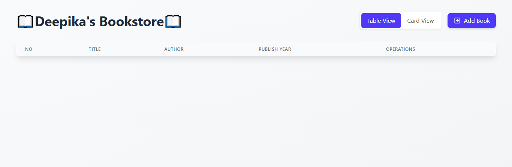
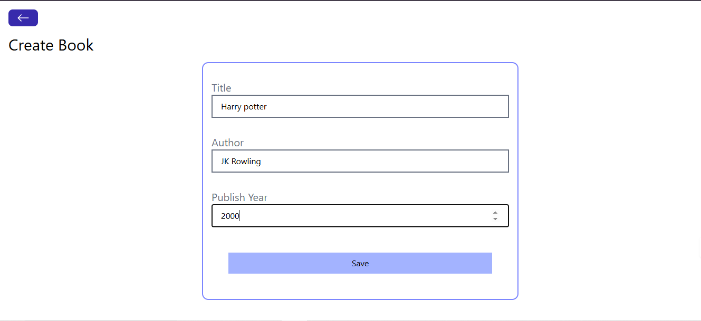
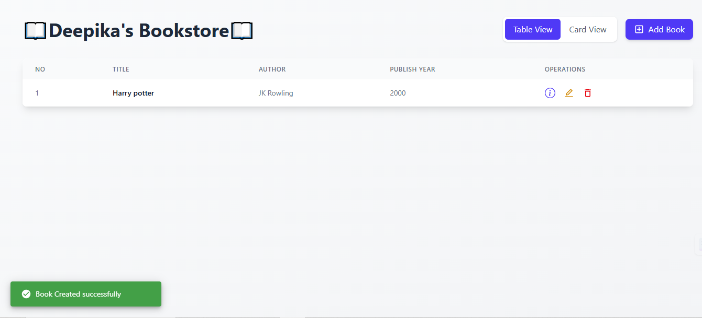
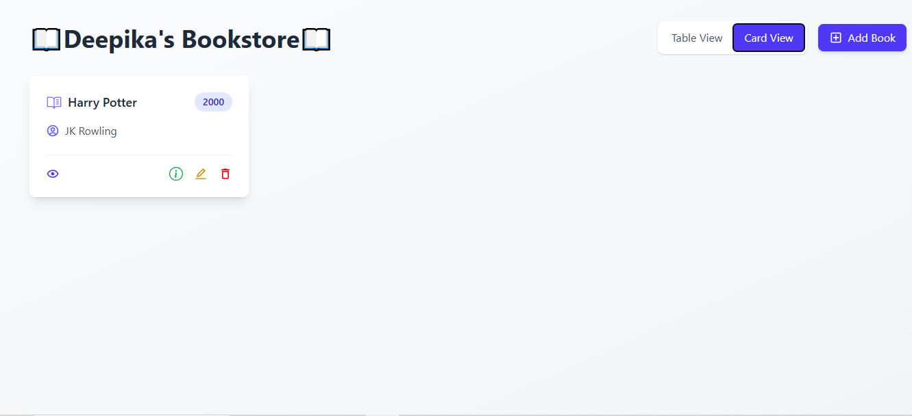
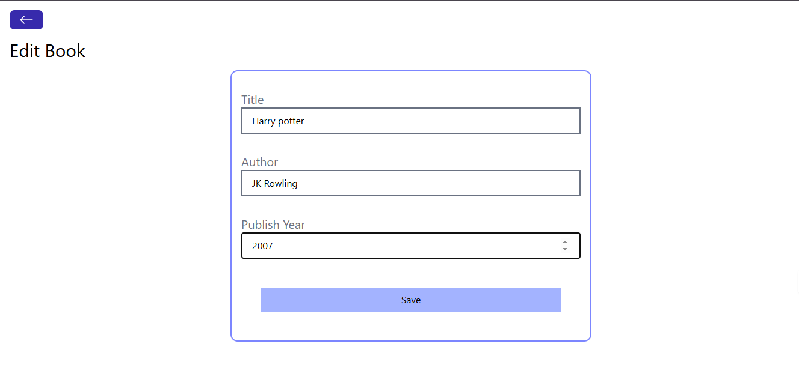
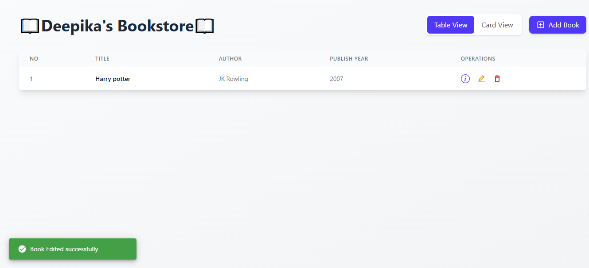
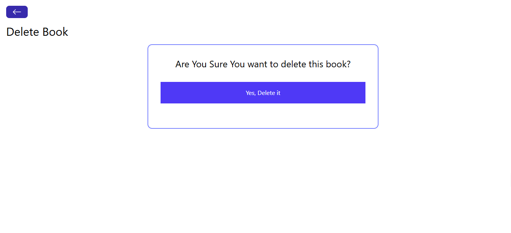
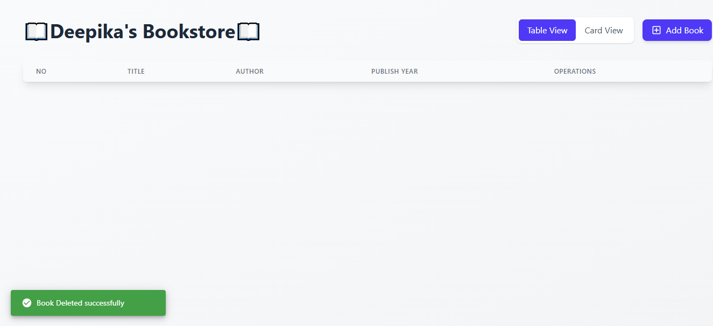

# Deepika's Bookstore - MERN Stack Application

A full-stack web application for managing a bookstore's inventory, built using the MERN (MongoDB, Express.js, React.js, Node.js) stack.

## Features

- Create, Read, Update and Delete books (CRUD operations)
- Responsive user interface built with React and Tailwind CSS
- Real-time notifications using Notistack
- Backend API built with Express.js and MongoDB
- Client-side routing with React Router

## Key Functionalities

- View all books in the inventory
- Add new books with title, author and publish year
- Edit existing book details
- Delete books from inventory
- View detailed information about each book including creation and update timestamps
- Responsive design that works on desktop and mobile devices

## Output screenshots
#### Home Page


#### Add Book Page



#### View Book Page


#### Edit Book Page



#### Delete Book Page



## Technologies Used

### Frontend
- React.js
- Tailwind CSS for styling
- Axios for API requests
- React Router for navigation
- Notistack for notifications

### Backend
- Node.js
- Express.js
- MongoDB for database
- Mongoose ODM

## Project Structure

The project is organized into two main directories:
- `frontend/`: Contains the React application
- `backend/`: Contains the Express.js server and API endpoints

## Getting Started

1. **Clone the repository**
   ```
   git clone https://github.com/Deepika-20022004/MERN-Bookstore.git
   ```

2. **Navigate to the project directory**
   ```
   cd MERN-Bookstore
   ```

3. **Install dependencies in both frontend and backend directories**
   ```bash
   cd backend
   npm install
   ```
   ```bash
   cd ../frontend
   npm install
   ```

3. **Set up MongoDB connection**

   - Create a `config.js` file in the `backend` folder and export your MongoDB URI:
    ```
    export const MONGO_URI=<your_mongodb_atlas_connection_string>
    ```

4. **Start the backend server**
   ```bash
   cd ../backend
   node index.js
   ```

5. **Start the frontend development server**
   ```bash
   cd ../frontend
   npm run dev
   ```

6. **Open your browser**
   - Visit [http://localhost:3000](http://localhost:3000) or [http://localhost:5173](http://localhost:5173) depending on your frontend setup.
